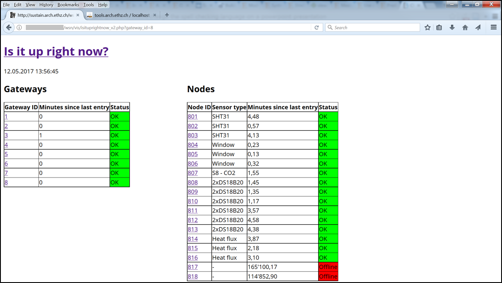
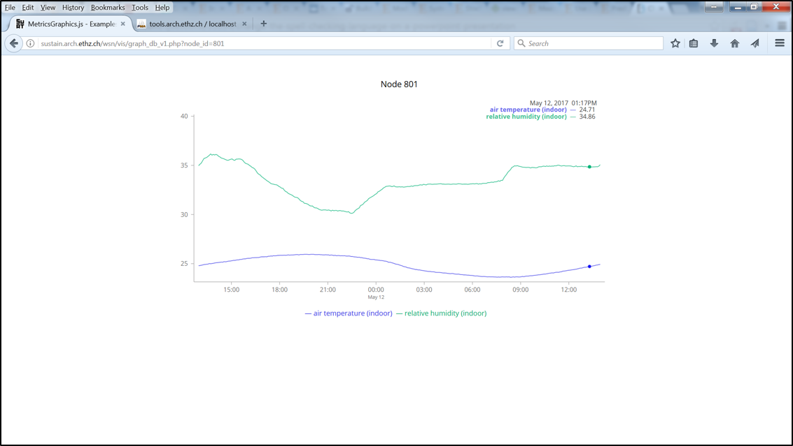

# Webserver
Two tasks are assigned to the webserver: 1. Inserting the measurement data into the database and 2. Displaying the measured data. All scripts are written in PHP.

## Storing Measured Data
All the files for storing the measured data in the database are in the [/gateway2mysql/ directory](PHP/gateway2mysql/). The main file is [gateway2mysql.php](PHP/gateway2mysql/gateway2mysql.php), which is also called by the gateway. The data is attached as an URL-parameter.
Currently, battery warning messages and data from the heat flux sensors need to be treated separately, since these messages do not yet adhere to the standard formatting. 

## Displaying Data
Files for these tasks can be found in the [/vis/](PHP/vis/) directory. The main file is [isituprightnow_v4.php](PHP/vis/isituprightnow_v4.php). The site shows tables. The left hand side table gives an overview of the gateway activity. The gateway number is clickable and leads to an overview of the sensor nodes. The right hand side table gives an overview of all the sensor nodes of one gateway. The node id is clickable and links to a graph of the respective measured data.

| |  |

## Setup
In order to setup the webserver the following needs to be done: 
* Import the MySQL database structure in phpMyAdmin using the SQL file in the [MySQL directory](MySQL).
* Copy the files from the folder [PHP](PHP) into the root directory of your webserver.
* Add the login credentials for the database to the [config file](PHP/config.php).
* Add the e-mail address of the admin to the [config file](PHP/config.php).
* Add the URL of your webserver to the Arduino [script for the gateway](../Gateway/Arduino). The URL should look something like this: yourdomainname.com/gateway2mysql/gateway2mysql.php

There are two main PHP scripts:
* [PHP/vis/isituprightnow_v4.php](PHP/vis/isituprightnow_v4.php) gives an overiew of the status of sensor nodes.
* [PHP/gateway2mysql/gateway2mysql.php](PHP/gateway2mysql/gateway2mysql.php) is called by the gateways. It takes the payload message with the measured data, disaggregates it and inserts it in the database.
